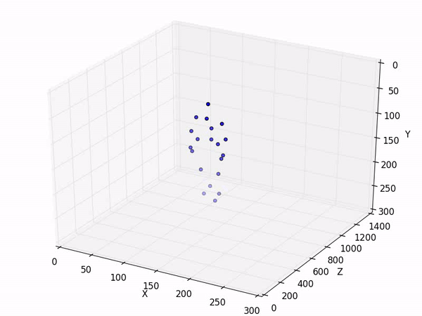

# Human-Action-Recognition :skull:
 
Action: Tennis Serve

## Datasets

20 action types, 10 subjects, each subject performs each action 2 or 3 times. There are 567 depth map sequences in total. The resolution is 640x240. The data was recorded with a depth sensor similar to the Kinect device. The dataset is described in the following paper.

Action Recognition Based on A Bag of 3D Points, Wanqing Li, Zhengyou Zhang, Zicheng Liu, IEEE International Workshop on CVPR for Human Communicative Behavior Analysis (in conjunction with CVPR2010), San Francisco, CA, June, 2010.

https://www.uow.edu.au/~wanqing/#Datasets

## Code
**MSRAction3DSkeleton(20joints) Dataset Reading and Creating Animation** ([Jupyter Notebook](MSRAction3D_Dataset_Reading_Visualization.ipynb))

